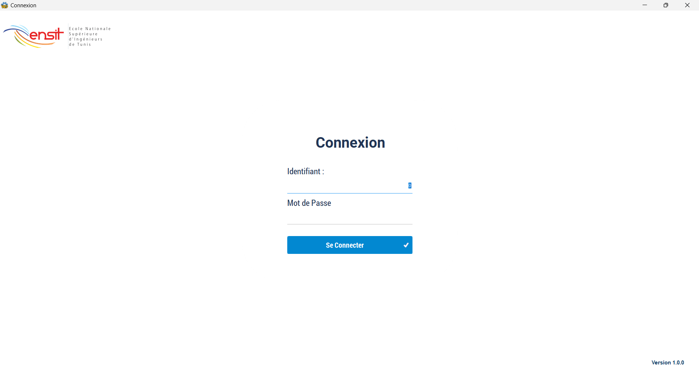
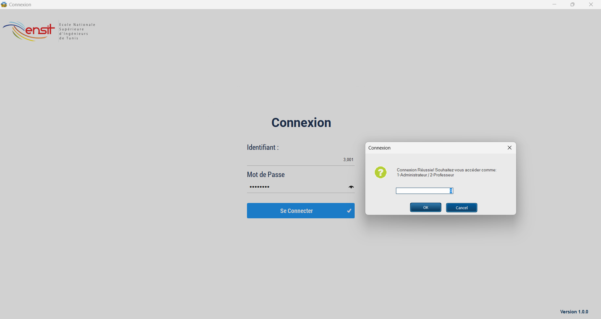
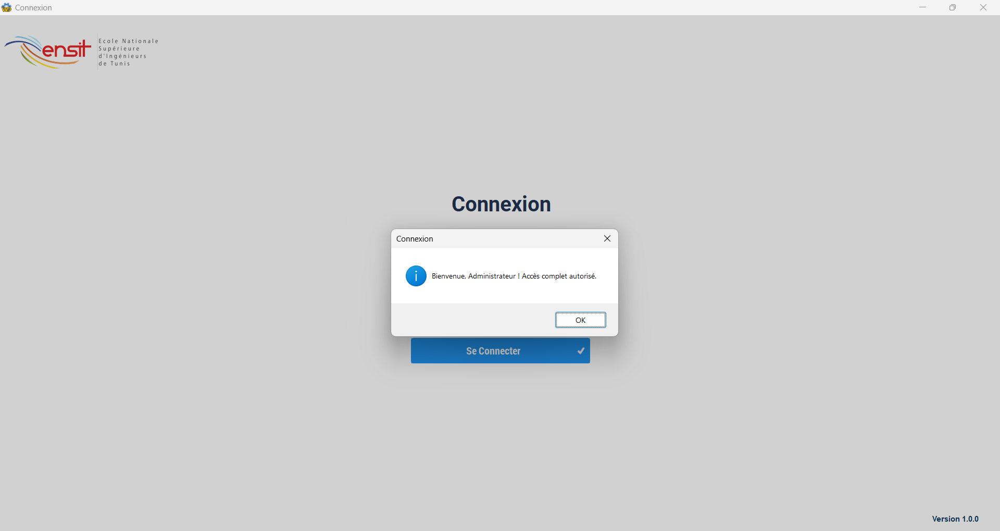
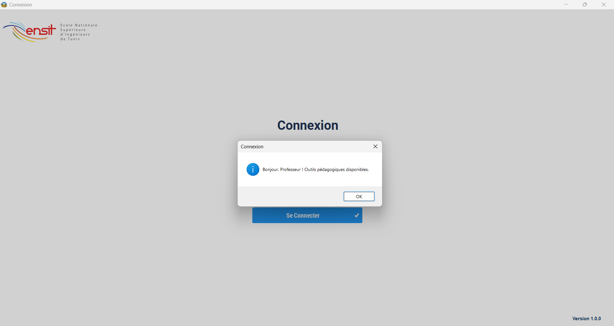
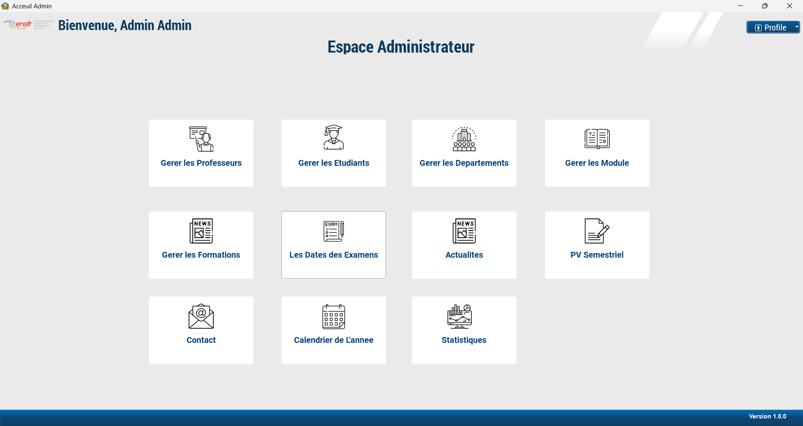
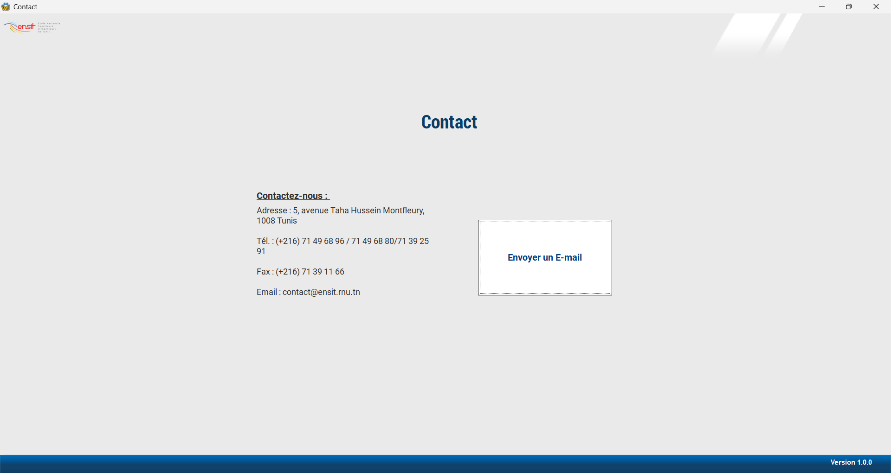
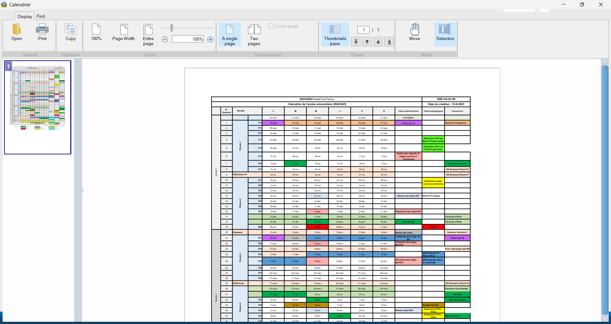
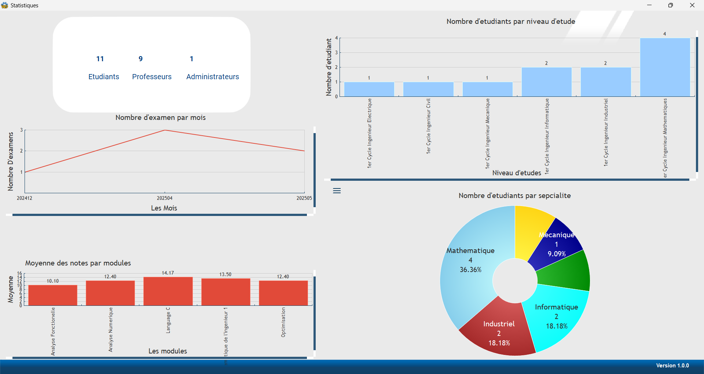

# University Grade Management App

A desktop application built with **WinDev** to simplify the management of university student records and grades. It provides a secure, role-based interface for admins, teachers, and students to manage and view academic information.

---

## Features

- **Role-based login**: Secure access for Admins, Teachers, and Students.
- **Comprehensive Management**: Easily manage students, teachers, courses, and grades.
- **Automatic Grade Calculation**: Streamlined and accurate grade processing.
- **Visual Grade Consultation**: Role-specific visual displays of academic performance.
- **Organized Database**: Simple and efficient database structure for easy data handling.

---

## Technologies Used

- **WinDev**: For robust desktop application development.
- **HFSQL**: For efficient database management.

---

## How to Run the App

1.  **Clone this repository**:
    ```bash
    git clone [https://github.com/Taha2053/PFA1.git](https://github.com/Taha2053/PFA1.git)
    ```
    (Note: You will need WinDev to access the source code.)
2.  **Download the application**: Get the executable from the releases page:
    ```bash
    [https://github.com/Taha2053/PFA1/tags](https://github.com/Taha2053/PFA1/tags)
    ```

---

## Application Components

### Login Page

A secure login screen with role selection and authentication.



Automatic authentication based on the user's role:

<p align="center">
  
  
  
  
</p>

---

### Dashboards

**Admin Dashboard**


**Teacher Dashboard**


**Student Dashboard**


---

### Profile Settings

Logout and application settings.


Profile Settings.


---

### Management Windows

**Manage Teachers**


**Manage Students**


**Manage Departments**


**Manage Modules (Courses)**


**Manage Programs (Formations)**


**Exam Dates Management**


**News Management**


**Semester Report (PV Semestriel)**


---

### Communication & Documents

**Contact Page**
<p align="center">
  
  
</p>

**Annual Calendar**


**Statistics**


**Add Documents (PDF)**: Allows adding PDF documents for students to access.


---

### Data Entry and Modification

**Add a Teacher**: (Applies similarly to adding other elements in the application.)


**Modify a Teacher**: (Applies similarly to modifying other elements in the application.)


---

### Grade Management for Teachers and Students

**Teacher's Grade Entry**: Teachers can input student grades.


**Student's Grade Access**: Students can view their grades, module averages, module credits, attendance records, modules to retake (due to low average), and modules to retake (due to excessive absences or module average below 10).


---

### Usability Features

**Filters**: Filters are provided in each window to facilitate convenient access to information.

**Deletion Confirmation**: Deleting elements from the application requires that the element is not linked to another and that the password must be entered to confirm the deletion.